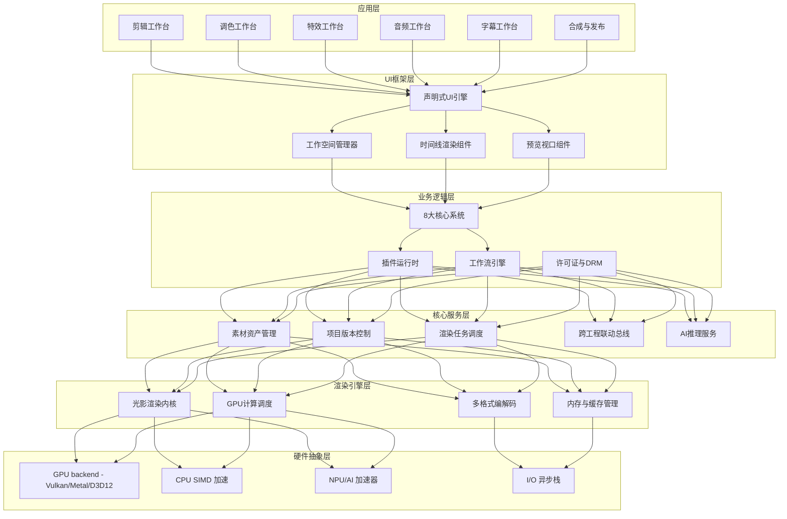
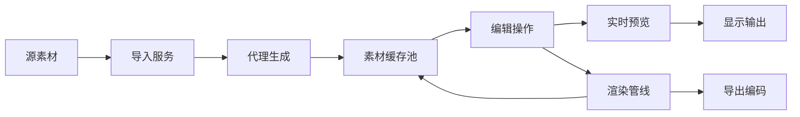
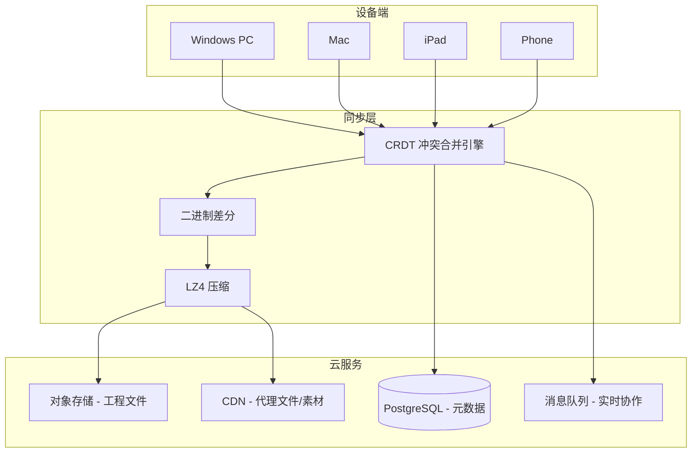

# Nova Edit（新星剪辑）系统架构设计

> 版本：v1.0 | 日期：2026-06-21 | 分类：技术架构文档  
> 密级：内部-投资人/CTO/核心开发团队

---

## 目录

1. [整体分层架构](#1-整体分层架构)
2. [自研光影渲染引擎](#2-自研光影渲染引擎)
3. [跨平台架构](#3-跨平台架构)
4. [数据同步与工程文件格式](#4-数据同步与工程文件格式)
5. [技术栈选型](#5-技术栈选型)
6. [性能指标定义](#6-性能指标定义)
7. [安全与合规架构](#7-安全与合规架构)

---

## 1. 整体分层架构

Nova Edit 采用**六层分层架构**，自底向上分别为：硬件抽象层（HAL）、渲染引擎层、核心服务层、业务逻辑层、UI 框架层、应用层。层间通过严格定义的 API 接口通信，上层不直接访问下层私有实现。

### 1.1 架构总览图



### 1.2 各层职责

| 层级 | 职责 | 关键约束 |
|------|------|----------|
| **硬件抽象层 (HAL)** | 封装 GPU/CPU/NPU 差异，提供统一计算后端 | 零平台相关代码向上泄露 |
| **渲染引擎层** | 自研光影引擎核心，管理 GPU 管线、编解码、内存池 | 所有像素操作必须走本层 |
| **核心服务层** | 素材索引、版本树、渲染队列、AI 推理调度 | 无状态服务，可水平扩展 |
| **业务逻辑层** | 8 大系统业务实现、插件 SDK、工作流 DAG 执行 | 模块间解耦，通过事件总线通信 |
| **UI 框架层** | 跨平台声明式 UI、工作空间布局、时间线渲染 | 60fps 滚动，<8ms 输入延迟 |
| **应用层** | 各工作台入口，用户交互逻辑 | 工作台可动态装卸 |

### 1.3 数据流向



- **实时预览路径**（< 33ms 延迟）：素材缓存池 → GPU 纹理 → 特效管线 → 视口呈现
- **最终渲染路径**：编辑操作日志 → 渲染任务图 → GPU 离线渲染 → 编码输出
- **代理模式**：8K/高码率素材自动生成 1080p 代理，编辑时透明切换

---

## 2. 自研光影渲染引擎

### 2.1 设计目标

| 指标 | 目标值 | 行业对比 |
|------|--------|----------|
| 单帧渲染延迟 (4K) | < 16ms | PR 约 22ms, 达芬奇约 18ms |
| 色彩精度 | 32-bit float 线性 | 达芬奇同级 |
| HDR 支持 | Dolby Vision / HDR10+ / HLG | 全格式 |
| GPU 显存效率 | 4K 时间线 < 6GB | AE 同素材常超 10GB |
| 多 GPU 扩展 | 线性加速比 > 0.85 | — |
| 实时预览帧率 | 8K 素材 ≥ 24fps (RTX 4090) | 达芬奇同级 |

### 2.2 引擎核心架构

```
┌────────────────────────────────────────────┐
│           光影渲染引擎 (Nova Render)         │
├────────────────────────────────────────────┤
│  场景图 (Scene Graph)                       │
│  ├─ 图层节点、变换节点、特效节点              │
│  └─ 惰性求值 + 脏标记传播                    │
├────────────────────────────────────────────┤
│  渲染图 (Render Graph)                      │
│  ├─ 资源屏障自动推导                         │
│  ├─ Render Pass 合并优化                     │
│  └─ 显存别名分析 (Memory Aliasing)           │
├────────────────────────────────────────────┤
│  着色器编译器 (Shader Compiler)              │
│  ├─ 自定义 NovaSL → SPIR-V / MSL / DXIL     │
│  └─ JIT 编译 + 热点缓存                      │
├────────────────────────────────────────────┤
│  GPU 调度器                                 │
│  ├─ 异步计算队列 (Async Compute)             │
│  ├─ 传输队列与渲染队列重叠                    │
│  └─ 多 GPU 工作分发 (NVLink/SLI)            │
├────────────────────────────────────────────┤
│  纹理与缓冲管理器                            │
│  ├─ 稀疏纹理 (Sparse/Tiled)                 │
│  ├─ 虚拟纹理流式加载                         │
│  └─ 池化分配，减少碎片                       │
└────────────────────────────────────────────┘
```

### 2.3 现有引擎对比

| 特性 | Nova 光影引擎 | Davinci Resolve | Adobe PR (Mercury) | AE (Render Queue) |
|------|:---:|:---:|:---:|:---:|
| 渲染图自动优化 | ✅ | 部分 | ❌ | ❌ |
| 自研着色语言+跨平台编译 | ✅ NovaSL | ❌ | ❌ | ❌ |
| VRAM 别名分析 | ✅ | ❌ | ❌ | ❌ |
| 异步计算队列深度集成 | ✅ | 基础 | 基础 | 基础 |
| 多 GPU 线性扩展 | ✅ | 有限 | ❌ | ❌ |
| 32-bit float 全管线 | ✅ | ✅ | 部分 | 部分 |
| 稀疏虚拟纹理 | ✅ | ❌ | ❌ | ❌ |
| AI 推理 GPU 内联 | ✅ | 部分 | ❌ | ❌ |

### 2.4 NovaSL 着色语言

自研 NovaSL（Nova Shading Language）是引擎的核心创新：

- **语法**：类 Rust 的现代着色语言，支持模块、泛型、Trait
- **编译目标**：SPIR-V (Vulkan)、MSL (Metal)、DXIL (D3D12)，一次编写三端运行
- **特性**：编译期资源绑定验证、自动 LOD 推导、内置 AI 推理原语
- **示例**：

```rust
// NovaSL 示例：环境光跟随调色
shader AmbientAdaptiveGrade {
    uniform texture2D input_tex;
    uniform texture2D ambient_light_map;
    uniform float3 target_color_temp = float3(1.0, 1.0, 1.0);
    
    @fragment
    fn main(in float2 uv: TEXCOORD0) -> float4 {
        let pixel = input_tex.sample(uv);
        let ambient = ambient_light_map.sample(uv);
        let corrected = color_adapt(pixel, ambient, target_color_temp);
        return float4(corrected, pixel.a);
    }
}
```

---

## 3. 跨平台架构

### 3.1 代码复用策略

```
                    ┌──────────────────┐
                    │   业务逻辑 (Rust)  │  85%+ 代码复用
                    │   跨平台共享层    │
                    └────────┬─────────┘
           ┌─────────────────┼─────────────────┐
           ▼                 ▼                  ▼
    ┌──────────────┐  ┌──────────────┐  ┌──────────────┐
    │  Windows/macOS│  │     iOS      │  │   Android    │
    │  Desktop UI   │  │  SwiftUI     │  │  Jetpack     │
    │  (WGPU+EGUI)  │  │   Bridge     │  │  Compose     │
    └──────┬───────┘  └──────┬───────┘  └──────┬───────┘
           │                 │                  │
           ▼                 ▼                  ▼
    ┌──────────────────────────────────────────────────┐
    │            Nova 渲染引擎 (C++/Rust)               │
    │  Vulkan (Win/Android) | Metal (macOS/iOS) | D3D12  │
    └──────────────────────────────────────────────────┘
```

| 层级 | 语言 | 跨平台策略 | 复用率 |
|------|------|-----------|--------|
| 渲染引擎 | C++20 + Rust | 一次编写，Vulkan/Metal/D3D12 三后端 | 95% |
| AI 推理 | Rust + ONNX Runtime | 统一推理图，平台后端适配 | 90% |
| 业务逻辑 | Rust | 单一代码库，平台无关 | 85% |
| 编解码 | Rust + FFmpeg | 平台自适应硬件加速 | 80% |
| UI | Rust EGUI (桌面) / SwiftUI (iOS) / Compose (Android) | 各端原生 UI，ViewModel 共享 | 60% |

### 3.2 移动端适配策略

- **手机端**：精简工作台，仅保留剪辑+调色+字幕核心三件套
- **平板端**：全功能工作台，支持 Apple Pencil / S Pen 精确操作
- **触摸优化**：手势引擎独立抽象层，统一处理手势冲突
- **性能梯度**：根据设备 GPU 算力自动降级特效质量（LOD）

---

## 4. 数据同步与工程文件格式

### 4.1 工程文件格式：.nova

Nova Edit 使用自研 `.nova` 包格式（实质为 ZIP 压缩的目录结构）：

```
Project.nova/
├── manifest.json          # 工程元信息
├── timeline/              # 时间线数据
│   ├── sequence_0.novatl  # 序列0（二进制格式）
│   └── sequence_1.novatl
├── assets/                # 素材引用索引
│   └── asset_registry.db   # SQLite 素材注册表
├── edits/                 # 编辑操作日志（CRDT）
│   └── op_log.crdt
├── grades/                # 调色预设
│   └── *.cubes / *.nova_grade
├── effects/               # 特效参数
│   └── *.nova_fx
├── audio/                 # 音频工程
│   └── mix.nova_audio
├── subtitles/             # 字幕数据
│   └── *.srt.nova
├── thumbnails/            # 缩略图缓存
└── proxies/               # 本地代理文件（不参与云同步）
```

### 4.2 云端同步架构



- **CRDT 冲突解决**：编辑操作基于 RGA (Replicated Growable Array) 算法，支持离线编辑后自动合并
- **增量同步**：仅传输变更的操作日志，非全量文件
- **素材云端引用**：素材文件保留在本地或用户自选云存储，工程文件仅存引用路径和指纹哈希
- **实时协作**：基于 WebSocket + CRDT，支持最多 16 人同时编辑同一工程

### 4.3 跨设备无缝切换

| 场景 | 实现方式 |
|------|----------|
| PC 粗剪 → iPad 精剪 | 工程自动同步，未完成代理自动触发云端转码 |
| 手机拍摄 → PC 调色 | 素材自动上传至中转桶，PC 端检出 |
| 多人云审阅 | 时间戳评论锚定帧，Markers 实时同步 |
| 离线编辑 | 本地 full CRDT log，上线后自动 merge |

---

## 5. 技术栈选型

### 5.1 各模块技术方案

| 模块 | 核心技术 | 备选/补充 | 选型理由 |
|------|----------|-----------|----------|
| **渲染引擎** | C++20 + Rust (FFI) | — | C++ GPU 生态 + Rust 安全边界 |
| **GPU 后端** | Vulkan 1.3 / Metal 3 / D3D12 | WebGPU (未来 Web 端) | Vulkan 跨平台最广, Metal iOS 最优, D3D12 Xbox |
| **着色语言** | 自研 NovaSL | GLSL (兼容导入) | 统一编译目标，杜绝平台分支 |
| **AI 推理** | ONNX Runtime + TensorRT | CoreML (iOS) / SNPE (Android) | 统一模型格式，平台后端自适应 |
| **编解码** | FFmpeg 7.x + 硬件加速 | NVENC / VideoToolbox / MediaCodec | 格式全覆盖 + 硬件编码零拷贝 |
| **音频引擎** | 自研 NovaAudio (Rust) | — | 低延迟 ASIO/CoreAudio/WASAPI |
| **UI 框架 (桌面)** | EGUI (Rust) + wgpu | — | 即时模式 GUI，与渲染引擎共用 GPU 上下文 |
| **UI 框架 (移动)** | SwiftUI + Jetpack Compose | — | 原生性能 + 平台生态 |
| **工程文件 DB** | SQLite (本地) + PostgreSQL (云端) | — | SQLite 单文件便携，PG 云端扩展 |
| **同步协议** | CRDT (yrs/Automerge) | — | 成熟 Rust CRDT 库 |
| **插件 SDK** | Rust trait + C ABI | Lua/Python 脚本层 | Rust 性能 + C ABI 最大兼容 |
| **构建系统** | CMake + Cargo | — | C++ / Rust 混合构建 |
| **CI/CD** | GitHub Actions + 自建 GPU 集群 | — | GPU 渲染测试需要物理硬件 |

### 5.2 核心技术栈总表

| 类别 | 选择 | 版本 |
|------|------|------|
| 引擎语言 | C++20 / Rust 2024 | GCC 14+ / Clang 18+ / rustc 1.85+ |
| GPU API | Vulkan 1.3 / Metal 3 / D3D12 | — |
| 着色语言 | NovaSL (自研) | v0.1 |
| 数学库 | nalgebra (Rust) / GLM (C++) | — |
| AI 框架 | ONNX Runtime | 1.20+ |
| 音频 | NovaAudio (自研, Rust) | v0.1 |
| 视频编码 | FFmpeg | 7.x |
| UI (桌面) | EGUI + wgpu | 0.30+ |
| 存储 | SQLite 3 + RocksDB | — |
| 网络 | QUIC / WebSocket / gRPC | — |
| 脚本 | Lua 5.4 / Python 3.12 (插件) | — |
| 测试 | Catch2 (C++) / Criterion (Rust) | — |

---

## 6. 性能指标定义

### 6.1 最低硬件标准

| 配置项 | 最低要求 (1080p) | 推荐配置 (4K) | 专业配置 (8K) |
|--------|:---:|:---:|:---:|
| CPU | Intel i5-12400 / AMD R5 7600 | i7-14700K / R9 7950X | Threadripper 7970X / Xeon W |
| GPU | GTX 1660 Super (6GB) | RTX 4070 Ti (12GB) | RTX 5090 (32GB) / A6000 |
| RAM | 16 GB DDR5 | 32 GB DDR5 | 64 GB DDR5 ECC |
| 存储 | NVMe SSD 512GB | NVMe SSD 1TB (PCIe 4.0) | NVMe RAID 0 (PCIe 5.0) 4TB+ |
| 显示器 | sRGB 100% | DCI-P3 95% + 硬件校准 | Dolby Vision HDR 参考监视器 |
| 网络 | 10 Mbps | 100 Mbps | 10 Gbps (协作/云渲染) |

### 6.2 关键性能指标 (KPI)

| 指标 | 1080p | 4K | 8K |
|------|:---:|:---:|:---:|
| 实时预览帧率 (无特效) | 60fps | 60fps | 30fps |
| 实时预览帧率 (全特效) | 30fps | 24fps | 16fps |
| 渲染导出速度 (H.265) | 3x 实时 | 1x 实时 | 0.3x 实时 |
| 启动时间 (冷启动) | < 3s | < 3s | < 3s |
| 工程加载 (1000 片段) | < 5s | < 8s | < 12s |
| 时间线拖拽延迟 | < 8ms | < 12ms | < 16ms |
| 视频导出码率上限 | 300 Mbps | 800 Mbps | 2000 Mbps |
| 同时实时协作人数 | 16 人 | 8 人 | 4 人 |

### 6.3 GPU 显存预算 (4K 时间线典型值)

| 消费者 | 显存占用 |
|--------|:---:|
| 操作系统 + 驱动 | ~800 MB |
| Nova 引擎运行时 | ~500 MB |
| 当前帧纹理 (4K RGBA32F) | ~128 MB |
| 前后帧缓存 (3 帧) | ~384 MB |
| 特效中间缓冲 | ~1.5 GB |
| AI 推理模型 | ~1 GB |
| 素材缓存池 | ~1.5 GB |
| **合计** | **~5.8 GB** |

---

## 7. 安全与合规架构

### 7.1 版权保护

- **指纹识别**：导入素材自动计算感知哈希 + 音频指纹，接入版权数据库
- **合规检测**：实时比对 Content ID 数据库，标注版权素材并提示替换
- **许可证管理**：内置素材商店，自动管理授权范围和到期时间

### 7.2 DRM

- 工程文件可选 AES-256-GCM 加密
- 导出时可选水印嵌入（可见/不可见）
- 协作场景下细粒度权限控制（查看/评论/编辑/导出）

---

> **下一文档**：[02-模块详细设计](./02-模块详细设计.md)
