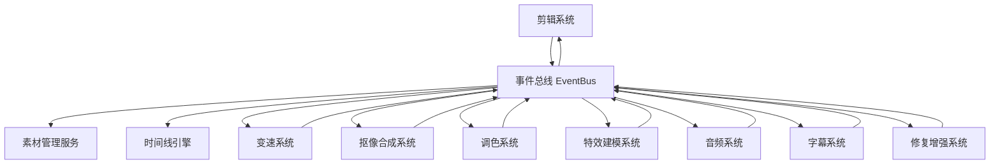
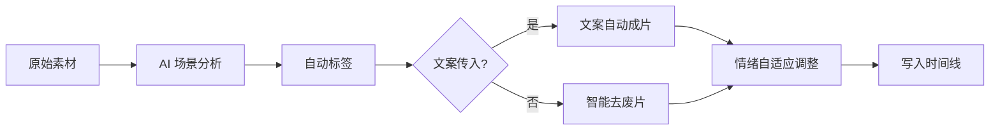
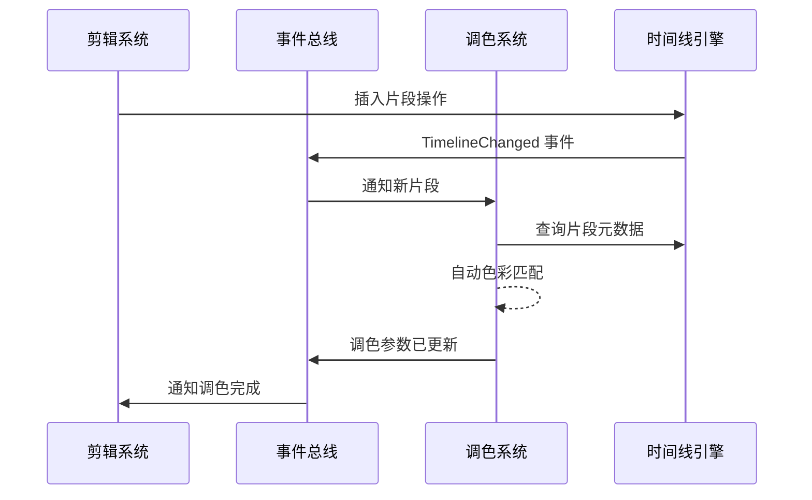

# Nova Edit（新星剪辑）模块详细设计

> 版本：v1.0 | 日期：2026-06-21 | 分类：模块设计文档

---

## 目录

1. [模块总览](#1-模块总览)
2. [剪辑系统](#2-剪辑系统)
3. [变速系统](#3-变速系统)
4. [抠像合成系统](#4-抠像合成系统)
5. [调色系统](#5-调色系统)
6. [特效建模系统](#6-特效建模系统)
7. [音频系统](#7-音频系统)
8. [字幕系统](#8-字幕系统)
9. [修复增强系统](#9-修复增强系统)
10. [模块间通信协议](#10-模块间通信协议)
11. [插件与扩展系统](#11-插件与扩展系统)

---

## 1. 模块总览

### 1.1 模块关系图



### 1.2 模块间依赖规则

- 模块通过**事件总线**通信，严禁直接引用其他模块内部数据结构
- 时间线数据由**时间线引擎**统一管理，各模块读写均通过标准 API
- 素材引用由**素材管理服务**统一解析，模块持有轻量 `AssetHandle`
- AI 推理请求统一走**AI 推理服务**，支持 GPU 内联和远端推理两种模式

---

## 2. 剪辑系统

### 2.1 功能规格

| 项目 | 描述 |
|------|------|
| **输入** | 视频/音频/图片素材、B-roll 片段、文字脚本、AI 分析结果 |
| **输出** | 时间线编辑操作序列、粗剪/精剪结果、自动成片工程 |
| **核心功能** | AI 语义剪辑、智能去废片、文案自动成片、情绪自适应剪辑 |

### 2.2 处理流程



### 2.3 API 接口定义

```rust
/// 剪辑系统核心接口
pub trait ClipSystem {
    /// AI 语义分析素材，返回场景分割和标签
    async fn analyze_clip(&self, asset: AssetHandle) -> Result<ClipAnalysis>;
    
    /// 智能去废片：识别模糊、抖动、过曝/欠曝、无声段落
    async fn smart_cull(&self, clips: Vec<ClipSegment>) -> Result<Vec<ClipSegment>>;
    
    /// 文案自动成片：根据脚本自动匹配素材并编排
    async fn auto_edit_from_script(&self, script: Script, asset_pool: AssetPool) -> Result<Timeline>;
    
    /// 情绪自适应剪辑：识别 BGM 情绪曲线，自动调整剪辑节奏
    async fn emotion_adaptive_edit(&self, timeline: Timeline, bgm: AssetHandle) -> Result<Timeline>;
    
    /// 镜头逻辑自检：检查跳切、光影不匹配、音画不同步、节奏异常
    async fn logic_check(&self, timeline: &Timeline) -> Result<Vec<ClipWarning>>;
}

#[derive(Debug, Serialize, Deserialize)]
pub struct ClipAnalysis {
    pub scene_boundaries: Vec<TimeStamp>,    // 场景切换点
    pub shot_types: Vec<ShotType>,           // 景别分类
    pub content_tags: Vec<String>,           // 内容标签
    pub quality_scores: QualityReport,       // 画质评分
    pub face_regions: Vec<FaceRegion>,       // 人脸区域
    pub speech_segments: Vec<SpeechSegment>, // 语音段落
}

#[derive(Debug, Serialize, Deserialize)]
pub struct ClipWarning {
    pub severity: WarningLevel,
    pub category: WarningCategory,    // JumpCut / LightingMismatch / AVOutSync / PacingIssue
    pub timestamp: TimeStamp,
    pub suggestion: String,
}
```

### 2.4 关键算法

**智能去废片算法**：
- **模糊检测**：拉普拉斯方差 (Laplacian Variance)，阈值自适应
- **抖动检测**：光流幅值统计 + 频率分析
- **过曝/欠曝**：直方图裁切比例检测
- **无声段落**：RMS 能量阈值 + 静音时长判定
- **综合评分**：加权融合 → 低于阈值的片段标记为废片

**文案自动成片算法**：
1. NLP 解析脚本 → 提取语义段落 + 关键实体
2. 素材库向量化 (CLIP Embedding) → FAISS 索引
3. 语段 ↔ 素材 相似度匹配 → 二分图最优匹配 (Hungarian Algorithm)
4. 时序约束下全局优化 → 动态规划，最小化全局编辑代价

### 2.5 存储设计

```sql
-- 剪辑操作日志表
CREATE TABLE clip_operations (
    op_id        INTEGER PRIMARY KEY,
    timeline_id  TEXT NOT NULL,
    op_type      TEXT NOT NULL,          -- cut/trim/slip/slide/ripple/roll
    op_params    BLOB NOT NULL,          -- Protobuf 序列化参数
    timestamp    INTEGER NOT NULL,       -- Unix 微秒
    user_id      TEXT,
    crdt_lamport INTEGER NOT NULL        -- CRDT Lamport 时钟
);

-- AI 分析缓存表
CREATE TABLE clip_analysis_cache (
    asset_hash   TEXT PRIMARY KEY,       -- SHA-256
    analysis     BLOB NOT NULL,          -- Protobuf 序列化 ClipAnalysis
    model_version TEXT NOT NULL,
    created_at   INTEGER NOT NULL
);
```

---

## 3. 变速系统

### 3.1 功能规格

| 项目 | 描述 |
|------|------|
| **输入** | 时间线片段、目标变速曲线/倍率 |
| **输出** | 变速后的片段（含补帧）、音频（含变速不变调） |
| **核心功能** | 人体骨骼级变速（0.1x-20x）、AI 补帧、人声适配 |

### 3.2 API 接口

```rust
pub trait SpeedSystem {
    /// 曲线变速：传入关键帧速度点，输出速度曲线
    async fn curve_speed(&self, clip: ClipSegment, curve: SpeedCurve) -> Result<SpeedResult>;
    
    /// AI 光流补帧：在两帧之间生成中间帧
    async fn optical_flow_interpolation(&self, frame_a: Frame, frame_b: Frame, count: u32) -> Result<Vec<Frame>>;
    
    /// 变速不变调：变速后音频保持原始音高
    async fn pitch_preserving_speed(&self, audio: AudioBuffer, ratio: f64) -> Result<AudioBuffer>;
    
    /// 人声自适应：检测人声段，自动调整变速参数保护人声
    async fn voice_adaptive_speed(&self, clip: ClipSegment, target_ratio: f64) -> Result<SpeedResult>;
}

#[derive(Debug, Serialize, Deserialize)]
pub struct SpeedCurve {
    pub keyframes: Vec<SpeedKeyframe>,   // 关键帧
    pub interpolation: InterpolationMode, // 线性/贝塞尔/缓入缓出
}

#[derive(Debug, Serialize, Deserialize)]
pub struct SpeedKeyframe {
    pub time: TimeStamp,   // 时间点
    pub speed: f64,        // 速度倍率 0.1-20.0
}
```

### 3.3 关键算法

**AI 补帧 (Optical Flow Interpolation)**：

- 模型：RAFT-based 光流估计 + 融合网络
- 流程：
  1. 双向光流估计 (Forward + Backward Flow)
  2. 光流一致性检查 → 遮挡区域检测
  3. 自适应融合权重图
  4. 网格变形 + 像素合成
- 性能：4K 单对帧 ~80ms (RTX 4090)，批量处理可流水线化

**人声适配**：检测 80Hz-3kHz 频段能量集中区域 → 该区域限制最大变速比 → 非人声段自由变速

---

## 4. 抠像合成系统

### 4.1 功能规格

| 项目 | 描述 |
|------|------|
| **输入** | 带前景的视频/图片、背景素材（可选） |
| **输出** | 透明通道 + 新背景合成结果 |
| **核心功能** | 无痕万能抠像、物体隔离、动态遮挡自动补全 |

### 4.2 API 接口

```rust
pub trait KeyingSystem {
    /// 万能抠像：自动识别前景主体并生成 Alpha 遮罩
    async fn universal_keying(&self, frame: Frame, mode: KeyingMode) -> Result<AlphaMask>;
    
    /// 物体隔离：指定物体区域，将物体从背景中分离
    async fn object_isolation(&self, frame: Frame, roi: Rect, refinement: bool) -> Result<IsolatedObject>;
    
    /// 动态遮挡自动补全：被遮挡区域的智能填充
    async fn occlusion_inpaint(&self, frame: Frame, mask: AlphaMask, temporal_context: &[Frame]) -> Result<Frame>;
    
    /// 绿幕/蓝幕抠像（传统色键 + AI 边缘优化）
    async fn chroma_key(&self, frame: Frame, key_color: Color, spill_suppression: bool) -> Result<AlphaMask>;
}

pub enum KeyingMode {
    Auto,                    // 自动检测主体
    Semantic(String),        // 语义指定 ("人物", "车辆", "动物")
    PointGuided(Point),      // 点击指定
    ScribbleGuided(Scribble),// 涂鸦引导
}
```

### 4.3 关键算法

**无痕万能抠像**：

- **基础模型**：基于 SAM-2 (Segment Anything Model 2) 的实例分割
- **时序一致性**：Propagation-based，前一帧掩码引导当前帧
- **边缘优化**：Alpha Matting 后处理（Closed-Form Matting + Deep Image Matting）
- **发丝级精度**：Trimap 生成 → Learning-Based Matting → 边缘反锯齿

**动态遮挡自动补全**：

- 使用视频修复模型 (E2FGVI / ProPainter)
- 前向+后向光流传播已知像素
- 特征匹配填补大范围遮挡

---

## 5. 调色系统

### 5.1 功能规格

| 项目 | 描述 |
|------|------|
| **输入** | 视频帧序列、调色参数/LUT、环境光传感器数据 |
| **输出** | 调色后帧序列 |
| **核心功能** | 院线级示波器、环境光跟随调色、多镜头色差统一、人脸肤色保护 |

### 5.2 API 接口

```rust
pub trait ColorSystem {
    /// 应用 3D LUT 调色
    async fn apply_lut(&self, frame: Frame, lut: CubeLut, intensity: f32) -> Result<Frame>;
    
    /// 一级调色：曝光/对比度/高光/阴影/白平衡
    async fn primary_grade(&self, frame: Frame, params: PrimaryGradeParams) -> Result<Frame>;
    
    /// 二级调色：HSL 限定器 + 遮罩 + 跟踪
    async fn secondary_grade(&self, frame: Frame, qualifier: HslQualifier, adjustment: ColorAdjustment) -> Result<Frame>;
    
    /// 环境光跟随调色：根据环境光传感器实时调整显示 LUT
    async fn ambient_adaptive_grade(&self, frame: Frame, ambient: AmbientLight) -> Result<Frame>;
    
    /// 多镜头色差统一
    async fn multi_shot_color_match(&self, reference: &Frame, targets: &[Frame]) -> Result<Vec<Frame>>;
    
    /// 人脸肤色保护
    async fn skin_tone_protection(&self, frame: Frame, grade_params: PrimaryGradeParams) -> Result<Frame>;
    
    /// 生成示波器数据
    fn scopes(&self, frame: &Frame) -> ScopesData;
}

#[derive(Debug, Serialize, Deserialize)]
pub struct ScopesData {
    pub waveform_rgb: Vec<f32>,     // RGB 分量波形
    pub waveform_luma: Vec<f32>,    // 亮度波形
    pub vectorscope: Vec<f32>,      // 矢量示波器
    pub histogram_rgb: Vec<u32>,   // RGB 直方图
    pub histogram_luma: Vec<u32>,  // 亮度直方图
    pub cie_chromaticity: Vec<f32>,// CIE 色度图
}
```

### 5.3 关键算法

**人脸肤色保护**：

1. 人脸检测 → 语义分割提取面部区域
2. 面部区域转换到 HSV/YCbCr 色彩空间
3. 肤色范围约束 (H: 0-50°, S: 20-80%)
4. 调色参数对面部区域衰减应用 (基于距离场的 Alpha 混合)
5. 肤色记忆色映射 (Fitzpatrick 分类 + 偏好色调映射)

**多镜头色差统一**：

1. 提取参考帧和目标帧的颜色分布特征 (均值/协方差)
2. 颜色转移矩阵求解 (Color Transfer via Monge-Kantorovitch)
3. 局部自适应：按亮度区域分段匹配
4. 时序平滑：跨帧颜色转移参数 Kalman 滤波

---

## 6. 特效建模系统

### 6.1 功能规格

| 项目 | 描述 |
|------|------|
| **输入** | 视频帧、2D/3D 元素、粒子参数、转场类型 |
| **输出** | 合成后的视频帧 |
| **核心功能** | 2D/3D 轨道一体化、曲面跟踪贴合、粒子特效、内置爆款转场 |

### 6.2 API 接口

```rust
pub trait VfxSystem {
    /// 2D 特效层叠加
    async fn apply_2d_effect(&self, frame: Frame, effect: Effect2D, params: Value) -> Result<Frame>;
    
    /// 3D 模型导入与渲染
    async fn import_3d_model(&self, path: &str) -> Result<ModelHandle>;
    
    /// 曲面跟踪贴合：3D 元素贴合到视频中的曲面上
    async fn surface_tracking(&self, frame: Frame, model: ModelHandle, tracking_points: Vec<TrackPoint>) -> Result<Frame>;
    
    /// 粒子系统
    async fn spawn_particles(&self, emitter: ParticleEmitter, duration: TimeDuration) -> Result<Vec<Frame>>;
    
    /// 转场效果
    async fn apply_transition(&self, from: Frame, to: Frame, transition: TransitionType, progress: f32) -> Result<Frame>;
    
    /// 运动跟踪
    async fn motion_track(&self, frame_sequence: &[Frame], roi: Rect) -> Result<Vec<TrackPoint>>;
    
    /// 摄像机反求 (3D Camera Tracking)
    async fn camera_solve(&self, frame_sequence: &[Frame]) -> Result<CameraSolveResult>;
}

#[derive(Debug, Serialize, Deserialize)]
pub struct ParticleEmitter {
    pub emitter_type: EmitterType,    // 点/线/面/体发射器
    pub emission_rate: f32,           // 发射速率 (粒子/秒)
    pub particle_lifetime: f32,       // 生命周期 (秒)
    pub velocity: Vec3,               // 初始速度
    pub acceleration: Vec3,           // 加速度
    pub size_over_life: Curve<f32>,   // 大小曲线
    pub color_over_life: Curve<Color>,// 颜色曲线
    pub turbulence: f32,              // 湍流强度
    pub collision_enabled: bool,      // 碰撞检测
}

pub enum TransitionType {
    Dissolve, Glitch, Slide, Zoom, Spin, 
    LightLeak, Smoke, Liquid, PixelSort, Morph,
    Custom(String),
}
```

### 6.3 关键算法

**曲面跟踪贴合**：

1. 视频帧特征点提取 (SuperPoint)
2. 帧间跟踪 → 稀疏 3D 重建
3. 用户标注曲面区域 → 拟合 NURBS 曲面
4. 3D 模型变换矩阵 → World-to-Surface 映射
5. 渲染管线融合：3D 模型光栅化 → 与视频帧 Alpha 合成
6. 光照匹配：从视频帧估计环境光 → IBL 应用到 3D 模型

**粒子系统架构**：

- GPU 粒子：Compute Shader 并行更新 100万+ 粒子
- 生命周期管理：出生/更新/死亡三阶段
- 力场：重力、风力、湍流、吸引/排斥
- 渲染：Billboard / Mesh 实例化渲染

---

## 7. 音频系统

### 7.1 功能规格

| 项目 | 描述 |
|------|------|
| **输入** | 音频轨道、BGM、配音 |
| **输出** | 混音输出、处理后的音频轨道 |
| **核心功能** | AI 降噪、人声分离、AI 修音、智能卡点 |

### 7.2 API 接口

```rust
pub trait AudioSystem {
    /// AI 降噪
    async fn denoise(&self, audio: AudioBuffer, profile: NoiseProfile) -> Result<AudioBuffer>;
    
    /// 人声分离 (Music Source Separation)
    async fn vocal_separation(&self, audio: AudioBuffer) -> Result<SeparatedAudio>;
    
    /// AI 修音 (自动音准校正)
    async fn pitch_correction(&self, audio: AudioBuffer, scale: MusicalScale, strength: f32) -> Result<AudioBuffer>;
    
    /// 智能卡点：分析音频节拍，生成节奏标记
    async fn beat_detection(&self, audio: AudioBuffer) -> Result<Vec<BeatMarker>>;
    
    /// 自动闪避 (Ducking)：人声出现时自动压低背景音
    async fn auto_ducking(&self, voice: AudioBuffer, bgm: AudioBuffer) -> Result<AudioBuffer>;
    
    /// 空间音频混音 (Ambisonics / Dolby Atmos)
    async fn spatial_mix(&self, tracks: Vec<SpatialTrack>, config: SpatialConfig) -> Result<AudioBuffer>;
}

#[derive(Debug, Serialize, Deserialize)]
pub struct SeparatedAudio {
    pub vocals: AudioBuffer,     // 人声
    pub drums: AudioBuffer,      // 鼓组
    pub bass: AudioBuffer,       // 贝斯
    pub other: AudioBuffer,      // 其他乐器
}

#[derive(Debug, Serialize, Deserialize)]
pub struct BeatMarker {
    pub time: TimeStamp,
    pub strength: f32,           // 节拍强度 0-1
    pub is_downbeat: bool,       // 是否为强拍
    pub bpm: f32,                // 瞬时 BPM
}
```

### 7.3 关键算法

**人声分离 (Demucs / HTDemucs)**：

- 模型：Hybrid Transformer Demucs
- 输入端：立体声混合音频
- 输出端：4 stems (vocals / drums / bass / other)
- 实时性：GPU 上 10x 实时速度

**智能卡点**：

1. 多频段 Onset Detection (Spectral Flux)
2. BPM 估计 (Autocorrelation + Tempogram)
3. 节拍追踪 (Dynamic Programming Beat Tracking)
4. 强拍/弱拍分类 (基于节拍位置和能量)
5. 节拍网格生成 → 输出 BeatMarker 数组

---

## 8. 字幕系统

### 8.1 功能规格

| 项目 | 描述 |
|------|------|
| **输入** | 音频轨道、字幕文本、翻译目标语言 |
| **输出** | 时间轴字幕、双语字幕、动画字幕渲染 |
| **核心功能** | 双语实时字幕、智能避脸、错别字校对、批量动画排版 |

### 8.2 API 接口

```rust
pub trait SubtitleSystem {
    /// 语音识别生成字幕 (ASR)
    async fn speech_to_text(&self, audio: AudioBuffer, language: Language) -> Result<Vec<SubtitleSegment>>;
    
    /// 字幕翻译
    async fn translate_subtitles(&self, segments: Vec<SubtitleSegment>, target_lang: Language) -> Result<Vec<SubtitleSegment>>;
    
    /// 生成双语字幕
    async fn bilingual_subtitles(&self, audio: AudioBuffer, native_lang: Language, target_lang: Language) -> Result<BilingualSubtitles>;
    
    /// 智能避脸：检测人脸区域，自动调整字幕位置
    async fn face_aware_positioning(&self, frame: Frame, subtitle: SubtitleSegment, faces: Vec<FaceRegion>) -> Result<SubtitleLayout>;
    
    /// 错别字校对
    async fn spell_check(&self, text: &str) -> Result<SpellCheckResult>;
    
    /// 批量动画排版
    async fn batch_animation_style(&self, segments: Vec<SubtitleSegment>, style: SubtitleStyle) -> Result<Vec<AnimatedSubtitle>>;
}

#[derive(Debug, Serialize, Deserialize)]
pub struct SubtitleSegment {
    pub index: u32,
    pub start_time: TimeStamp,
    pub end_time: TimeStamp,
    pub text: String,
    pub translation: Option<String>,
    pub confidence: f32,          // ASR 置信度
    pub speaker_id: Option<u32>,  // 说话人 ID
}

#[derive(Debug, Serialize, Deserialize)]
pub struct BilingualSubtitles {
    pub native: Vec<SubtitleSegment>,
    pub translated: Vec<SubtitleSegment>,
    pub merged: Vec<SubtitleSegment>,  // 双语合并
}

#[derive(Debug, Serialize, Deserialize)]
pub struct SubtitleStyle {
    pub font: String,
    pub font_size: f32,
    pub color: Color,
    pub stroke_color: Color,
    pub stroke_width: f32,
    pub background: Option<Color>,
    pub animation: SubtitleAnimation,  // Typewriter / Fade / Slide / Bounce / Karaoke
    pub alignment: TextAlignment,
}
```

### 8.3 关键算法

**智能避脸**：

1. 人脸检测 → 获取所有人脸包围框
2. 字幕默认位置计算 (底部居中)
3. 碰撞检测：字幕矩形 vs 人脸矩形
4. 冲突解决策略：
   - 优先：垂直上移字幕（不超越画面 1/3）
   - 次选：缩小字号
   - 最终：临时改为顶部显示
5. 时序平滑：字幕位置变化使用缓动插值，避免跳动

**ASR 引擎**：

- 模型：Whisper Large v3 + 领域微调
- 支持语言：100+ 种
- 实时流式识别：分块音频送入 + 部分解码结果输出
- 说话人分离：基于声纹 Embedding 的聚类 (Speaker Diarization)

---

## 9. 修复增强系统

### 9.1 功能规格

| 项目 | 描述 |
|------|------|
| **输入** | 低质量/受损视频帧序列 |
| **输出** | 修复/增强后的视频帧序列 |
| **核心功能** | 超清修复、云台防抖、逆光提亮、AI 续写缺失画面 |

### 9.2 API 接口

```rust
pub trait RestoreSystem {
    /// 超清修复 (Super Resolution)
    async fn super_resolution(&self, frames: &[Frame], target_scale: u32) -> Result<Vec<Frame>>;
    
    /// 视频防抖 (Electronic Image Stabilization)
    async fn stabilization(&self, frames: &[Frame], mode: StabilizationMode) -> Result<Vec<Frame>>;
    
    /// 逆光提亮
    async fn backlight_enhance(&self, frame: Frame) -> Result<Frame>;
    
    /// AI 续写缺失画面 (Video Inpainting)
    async fn frame_inpainting(&self, damaged_regions: &[AlphaMask], temporal_context: &[Frame]) -> Result<Vec<Frame>>;
    
    /// 去噪 (Denoising)
    async fn denoise(&self, frames: &[Frame], strength: f32) -> Result<Vec<Frame>>;
    
    /// 去隔行 / 反胶转磁
    async fn deinterlace(&self, frame: Frame, field_order: FieldOrder) -> Result<Frame>;
    
    /// 画质综合评分
    async fn quality_assessment(&self, frame: &Frame) -> Result<QualityScore>;
}

#[derive(Debug, Serialize, Deserialize)]
pub struct QualityScore {
    pub sharpness: f32,       // 清晰度 0-100
    pub noise_level: f32,     // 噪点水平 (越低越好)
    pub dynamic_range: f32,   // 动态范围评分
    pub color_accuracy: f32,  // 色彩准确度
    pub compression_artifacts: f32, // 压缩伪影程度 (越低越好)
    pub overall: f32,         // 综合评分
}

pub enum StabilizationMode {
    Smooth,       // 平滑模式（保留运镜意图）
    Locked,       // 锁定模式（完全固定）
    ActiveTrack,  // 主动跟踪（跟踪指定目标）
}
```

### 9.3 关键算法

**超清修复**：

- 模型：Real-ESRGAN / BasicVSR++ (视频超分)
- 流程：
  1. 视频帧分组 (GOP 窗口)
  2. 对齐：双向光流帧对齐
  3. 融合：跨帧特征融合
  4. 重建：GAN 生成高分辨率细节
  5. 时序一致性：前后帧约束平滑
- 倍数：2x / 4x / 8x

**视频防抖**：

1. 帧间特征点匹配 → 运动估计
2. 运动轨迹平滑 (Gaussian / Kalman / Low-Pass Filter)
3. 计算补偿矩阵 → 透视变换
4. 边缘裁剪/填充处理
5. Rolling Shutter 校正 (可选)

---

## 10. 模块间通信协议

### 10.1 事件总线架构

```rust
/// 全局事件定义
#[derive(Debug, Serialize, Deserialize)]
pub enum NovaEvent {
    // 时间线事件
    TimelineChanged { timeline_id: Uuid, operation: TimelineOp },
    PlayheadMoved { timeline_id: Uuid, position: TimeStamp },
    
    // 素材事件
    AssetImported { asset_handle: AssetHandle },
    AssetModified { asset_handle: AssetHandle },
    AssetRemoved { asset_hash: String },
    
    // 渲染事件
    RenderFrameReady { timeline_id: Uuid, frame_index: u64, texture_handle: GpuTextureHandle },
    RenderComplete { job_id: Uuid, output_path: String },
    
    // AI 事件
    AiAnalysisComplete { asset_hash: String, analysis_type: AnalysisType },
    
    // 协作事件
    RemoteOpReceived { user_id: String, operation: TimelineOp },
    CollaborationUserJoined { user_id: String },
    
    // UI 事件
    WorkspaceChanged { workspace_id: String },
    UndoRedoStackChanged { can_undo: bool, can_redo: bool },
}
```

### 10.2 模块间数据共享



### 10.3 跨工程联动协议

```rust
/// 跨工程素材联动
pub trait CrossProjectLink {
    /// 注册工程间素材关联
    fn link_assets(&self, source_project: Uuid, target_project: Uuid, asset_mapping: HashMap<AssetHandle, AssetHandle>);
    
    /// 源工程素材变更 → 同步到关联工程
    async fn propagate_change(&self, source_asset: AssetHandle, change: AssetChange) -> Result<Vec<AssetHandle>>;
    
    /// 查询素材所有关联工程
    fn get_linked_projects(&self, asset: AssetHandle) -> Vec<Uuid>;
}
```

---

## 11. 插件与扩展系统

### 11.1 插件架构

```
┌────────────────────────────────────────────┐
│                Nova Edit 核心               │
├────────────────────────────────────────────┤
│           插件管理器 (Plugin Manager)        │
│  ┌──────────┐ ┌──────────┐ ┌────────────┐ │
│  │ 加载器    │ │ 沙箱     │ │ 生命周期   │ │
│  │ Loader   │ │ Sandbox  │ │ Lifecycle  │ │
│  └──────────┘ └──────────┘ └────────────┘ │
├────────────────────────────────────────────┤
│              插件 C ABI 层                  │
│     (所有插件通过此稳定接口与核心通信)        │
├────────────────────────────────────────────┤
│  插件 1       插件 2       插件 3      ...   │
│  (特效)       (转场)       (调色LUT)        │
└────────────────────────────────────────────┘
```

### 11.2 插件接口定义 (C ABI)

```c
// nova_plugin.h - 稳定插件 ABI

typedef struct NovaPluginV1 {
    // 元数据
    const char* name;
    const char* version;
    const char* author;
    NovaPluginCategory category;  // Effect / Transition / ColorGrade / AudioFX / Export / Import
    
    // 生命周期
    int (*init)(NovaHostAPI* host_api);
    int (*deinit)(void);
    
    // 参数系统
    size_t (*get_param_count)(void);
    NovaParamDef* (*get_param_defs)(void);
    int (*set_param)(uint32_t param_id, NovaVariant value);
    
    // 处理函数
    int (*process_frame)(NovaFrame* input, NovaFrame* output, NovaPluginContext* ctx);
    
    // UI 扩展 (可选)
    int (*get_ui_widget)(NovaWidgetHandle* widget);
    
    // 能力声明
    uint64_t capabilities;  // 位掩码: 需要 GPU / 需要 AI / 实时安全 等
} NovaPluginV1;

// 主机 API (插件可调用的核心能力)
typedef struct NovaHostAPI {
    // 素材访问
    int (*load_asset)(const char* path, NovaAssetHandle* handle);
    int (*get_frame)(NovaAssetHandle asset, uint64_t frame_idx, NovaFrame* frame);
    
    // GPU 资源
    int (*allocate_gpu_buffer)(size_t size, NovaGpuBuffer* buffer);
    int (*submit_compute_shader)(const char* shader_src, NovaComputeDispatch* dispatch);
    
    // AI 推理
    int (*run_inference)(const char* model_path, NovaTensor* inputs, size_t num_inputs, NovaTensor* outputs);
    
    // UI 交互
    int (*register_timeline_overlay)(NovaOverlayRenderer renderer);
    
    // 日志
    void (*log)(NovaLogLevel level, const char* message);
} NovaHostAPI;
```

### 11.3 插件安全模型

| 安全等级 | 权限 | 示例 |
|----------|------|------|
| **沙箱级** | 仅帧处理，无文件/网络访问 | 简单特效、LUT |
| **受限级** | 可读取指定目录、使用 GPU | 复杂特效、AI 插件 |
| **可信级** | 完整 API 访问，需代码签名 | 官方/认证合作伙伴插件 |

### 11.4 Lua 脚本层

面向轻量级定制需求，提供 Lua 5.4 脚本接口：

```lua
-- 自定义转场效果示例
function nova_transition(from_frame, to_frame, progress, params)
    local glitch_intensity = params.glitch or 0.5
    local result = nova.frame.create(from_frame.width, from_frame.height)
    
    if progress < 0.5 then
        -- 前半段：故障效果
        local glitch = nova.effect.glitch(from_frame, glitch_intensity * (1 - progress * 2))
        result:copy_from(glitch)
    else
        -- 后半段：渐变混合
        local blend = progress * 2 - 1
        result:blend(from_frame, to_frame, blend)
    end
    
    return result
end

-- 注册转场
nova.plugin.register_transition("Glitch Dissolve", "glitch_dissolve", nova_transition)
```

---

> **下一文档**：[03-开发路线图](./03-开发路线图.md)
