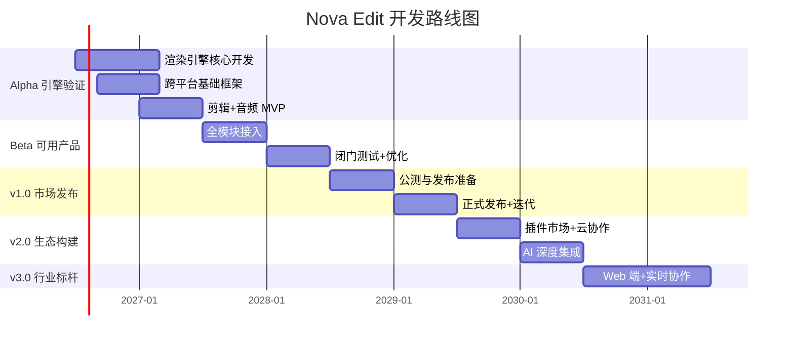

# Nova Edit（新星剪辑）开发路线图

> 版本：v1.0 | 日期：2026-06-21 | 分类：项目管理文档

---

## 目录

1. [总览与里程碑](#1-总览与里程碑)
2. [Alpha 阶段：引擎验证 (0-12月)](#2-alpha-阶段引擎验证-0-12月)
3. [Beta 阶段：可用产品 (12-24月)](#3-beta-阶段可用产品-12-24月)
4. [v1.0 阶段：市场发布 (24-36月)](#4-v10-阶段市场发布-24-36月)
5. [v2.0 阶段：生态构建 (36-48月)](#5-v20-阶段生态构建-36-48月)
6. [v3.0 阶段：行业标杆 (48-60月)](#6-v30-阶段行业标杆-48-60月)
7. [人力配置建议](#7-人力配置建议)
8. [竞品对比矩阵](#8-竞品对比矩阵)

---

## 1. 总览与里程碑



### 五阶段总览

| 阶段 | 时间 | 周期 | 团队规模 | 核心目标 |
|------|------|:---:|:---:|------|
| **Alpha** | 2026-Q3 → 2027-Q2 | 12 月 | 35-50 人 | 渲染引擎验证 + 核心剪辑流程跑通 |
| **Beta** | 2027-Q3 → 2028-Q2 | 12 月 | 60-80 人 | 8 大系统初步串联，闭门测试 |
| **v1.0** | 2028-Q3 → 2029-Q2 | 12 月 | 80-100 人 | 公测 → 正式发布，完成 v1.0 市场版本 |
| **v2.0** | 2029-Q3 → 2030-Q2 | 12 月 | 100-120 人 | 插件生态 + 云协作 + AI 深度集成 |
| **v3.0** | 2030-Q3 → 2031-Q2 | 12 月 | 120-150 人 | Web 端 + 实时协作 + 行业标准确立 |

---

## 2. Alpha 阶段：引擎验证 (0-12月)

### 2.1 里程碑

| 时间 | 里程碑 | 交付物 |
|------|--------|--------|
| 2026-Q3 (M1) | 光影引擎 v0.1 | NovaSL 编译器原型、Vulkan 渲染管线可运行 |
| 2026-Q4 (M2) | 跨平台三端可构建 | Win/Mac/iOS 同一代码库编译通过、基础 UI 框架跑通 |
| 2027-Q1 (M3) | 剪辑+音频 MVP | 时间线可剪辑播放、音频引擎 ASIO/WASAPI 低延迟 |
| 2027-Q2 (M4) | Alpha 里程碑 | 核心渲染管线稳定、粗剪+精剪流程闭环、内部 Demo 可演示 |

### 2.2 详细交付物

**M1 - 光影引擎 v0.1**:

- [x] NovaSL 编译器：NovaSL → SPIR-V / MSL 编译通路
- [x] Render Graph 基础框架：Pass 构建 + 资源屏障自动推导
- [x] GPU 纹理管理器：池化分配 + 稀疏纹理基础支持
- [x] 基础着色器库：颜色空间转换、缩放、混合
- [x] 性能基准测试套件：4K 帧吞吐量 > 30fps

**M2 - 跨平台基础框架**:

- [x] HAL 抽象层：统一 GPU Buffer / Texture / CommandBuffer 接口
- [x] 桌面端 UI：EGUI + wgpu 基础工作台框架，时间线组件原型
- [x] iOS 端：SwiftUI Bridge + Metal 渲染视口
- [x] C++ / Rust FFI 边界稳定
- [x] CI/CD 三平台自动构建流水线

**M3 - 剪辑 + 音频 MVP**:

- [x] 时间线引擎：多轨道、裁剪、分割、拖拽重排
- [x] 视频解码：FFmpeg 集成，H.264/H.265/ProRes 解码
- [x] 音频引擎：WASAPI (Win) / CoreAudio (Mac) 低延迟播放
- [x] 预览视口：实时帧渲染 + 音频同步
- [x] 基础导出：H.264 编码导出

**M4 - Alpha 里程碑**:

- [x] 粗剪工作流：素材导入 → 时间线编辑 → 预览 → 导出 全链路
- [x] 渲染引擎性能：4K 30fps 单轨播放稳定
- [x] GPU 显存占用 < 4GB (4K 时间线)
- [x] 崩溃率 < 1 次/小时
- [x] 内部技术 Demo 视频 + 白皮书

### 2.3 关键风险

| 风险 | 概率 | 影响 | 缓解措施 |
|------|:---:|:---:|------|
| NovaSL 编译器开发复杂度超预期 | 中 | 高 | 预留 2 个月缓冲，必要时先支持 GLSL 兼容导入 |
| GPU 驱动兼容性碎片化 | 高 | 中 | 建立多 GPU/驱动版本测试矩阵 |
| C++/Rust FFI 边界性能瓶颈 | 低 | 中 | 关键路径性能测试从 M1 开始，超标立即优化 |
| iOS Metal 管线与 Vulkan 行为差异 | 中 | 中 | 参考 MoltenVK 经验，Metal 专用路径兜底 |

---

## 3. Beta 阶段：可用产品 (12-24月)

### 3.1 里程碑

| 时间 | 里程碑 | 交付物 |
|------|--------|--------|
| 2027-Q3 (M5) | 8 大系统全部接入 | 调色/特效/字幕/抠像/变速/修复模块初步可用 |
| 2027-Q4 (M6) | 闭门 Beta 测试 | 邀请 500 名专业创作者测试，收集反馈 |
| 2028-Q1 (M7) | 性能与稳定性冲刺 | 崩溃率 < 0.1 次/小时，8K 30fps 可播放 |
| 2028-Q2 (M8) | Beta 发布就绪 | 全功能可用，文档齐全，可进入公测 |

### 3.2 详细交付物

**M5 - 8 大系统接入**:

| 系统 | 最低可用标准 |
|------|------------|
| 调色系统 | 一级调色面板 + 3D LUT + 基础示波器 |
| 特效系统 | 2D 图层特效 + 基础转场 (5-8 种) + 关键帧动画 |
| 字幕系统 | Whisper ASR 集成 + 字幕轨道 + 基础样式 |
| 抠像系统 | SAM 集成 + 绿幕色键 + 基础 Alpha 合成 |
| 变速系统 | 曲线变速 + 光流补帧 (1-2x) + 变速不变调 |
| 修复系统 | 基础降噪 + 电子防抖 + 基础超分 (2x) |
| AI 推理服务 | 统一调度框架 + 模型热加载 |

**M6 - 闭门 Beta 测试**:

- [x] 500 名种子用户招募 (专业剪辑师、UP 主、影视学生)
- [x] NDA 协议 + 反馈收集系统
- [x] 崩溃自动上报 + 使用行为分析 (需用户授权)
- [x] 双周迭代：根据反馈修复 Bug + 调整 UX

**M7 - 性能冲刺**:

| 指标 | 目标 |
|------|:---:|
| 4K 全特效预览 | 24fps |
| 8K 基础预览 | 30fps |
| 项目加载 (1000 片段) | < 8s |
| 内存泄漏 | 连续运行 8h 增长 < 200MB |
| 崩溃率 | < 0.1 次/小时 |

**M8 - Beta 就绪**:

- [x] 完整用户手册 (中/英)
- [x] 视频教程系列 (20+ 集)
- [x] 官网 + 社区论坛
- [x] 定价策略方案

---

## 4. v1.0 阶段：市场发布 (24-36月)

### 4.1 里程碑

| 时间 | 里程碑 | 交付物 |
|------|--------|--------|
| 2028-Q3 (M9) | 公测启动 | 限时免费公测，上限 10,000 用户 |
| 2028-Q4 (M10) | 移动端 Beta | iOS / Android 核心剪辑功能可用 |
| 2029-Q1 (M11) | 发布候选 (RC) | 全平台 RC 版本，完成本地化 |
| 2029-Q2 (M12) | **v1.0 正式发布** | Windows / macOS / iOS / Android 同步上线 |

### 4.2 v1.0 功能清单

**桌面端完整功能**:

- 8 大核心系统全部可用
- 镜头逻辑自检
- 跨工程素材联动同步
- 自定义工作流模板
- 全网平台一键分发 (B站/抖音/YouTube/TikTok 等)
- 版权全自动合规检测 (v1.0 基础版)

**移动端功能**:

- 剪辑 + 调色 + 字幕 核心三件套
- 移动端拍摄 → 桌面端无缝接力
- 竖屏短视频优化工作台

**发布准备**:

- [x] 中/英/日/韩 四语本地化
- [x] 定价方案：基础版免费 + Pro 订阅 ($14.99/月) + Studio 永久授权 ($299)
- [x] 应用商店过审 (Mac App Store / Microsoft Store / App Store / Google Play)
- [x] PR 策略 + KOL 合作 + 首发活动

---

## 5. v2.0 阶段：生态构建 (36-48月)

### 5.1 里程碑

| 时间 | 里程碑 | 交付物 |
|------|--------|--------|
| 2029-Q3 (M13) | 插件市场上线 | 第三方插件 SDK + 审核机制 + 在线市场 |
| 2029-Q4 (M14) | 云协作 v1 | 多用户实时协作编辑 |
| 2030-Q1 (M15) | AI 深度集成 | AI 自动成片 / AI 音乐生成 / AI 特效生成 |
| 2030-Q2 (M16) | **v2.0 发布** | 生态完整，用户数突破 50 万 |

### 5.2 关键功能

**插件市场**:

- 插件 SDK 稳定版发布
- 开发者文档 + 示例代码
- 插件审核流程 (安全 + 质量)
- 收益分成机制 (开发者 70% / 平台 30%)

**云协作**:

- 多人实时编辑 (最多 16 人)
- 云端渲染农场 (按需付费)
- 团队管理面板
- 企业版 SSO + 权限管理

**AI 深度集成**:

- 文本 → 视频：输入脚本自动生成完整视频
- AI 音乐生成：根据视频情绪自动生成 BGM
- AI 特效：文字描述 → 自动生成粒子/转场特效
- AI 智能剪辑 Agent：对话式剪辑助手

---

## 6. v3.0 阶段：行业标杆 (48-60月)

### 6.1 里程碑

| 时间 | 里程碑 | 交付物 |
|------|--------|--------|
| 2030-Q3 (M17) | Web 版 Nova Edit | 浏览器端完整剪辑体验 (WebGPU) |
| 2030-Q4 (M18) | 开放平台 | Nova API 开放，第三方可深度集成 |
| 2031-Q1 (M19) | 企业级方案 | 私有化部署 + 广电级集成方案 |
| 2031-Q2 (M20) | **v3.0 发布** | 行业标准地位确立，用户数突破 200 万 |

### 6.2 远景目标

- **Web 版**：基于 WebGPU 的浏览器端剪辑，无需安装
- **开放平台**：API 开放给 MCN、影视公司、在线教育平台
- **行业协议**：推动 `.nova` 成为行业工程交换标准格式
- **AI 全流程**：从创意到成片，AI 辅助覆盖 80% 流程节点
- **硬件生态**：与 GPU 厂商合作推出 Nova Edit 认证硬件

---

## 7. 人力配置建议

### 7.1 各阶段团队配置

| 角色 | Alpha | Beta | v1.0 | v2.0 | v3.0 |
|------|:---:|:---:|:---:|:---:|:---:|
| **引擎/渲染工程师** | 8 | 12 | 15 | 15 | 18 |
| **AI/ML 工程师** | 5 | 8 | 10 | 15 | 20 |
| **前端/UI 工程师** | 4 (桌面) | 6 + 2 (移动) | 8 + 4 | 10 + 6 + 2 (Web) | 12 + 8 + 4 |
| **后端/云服务工程师** | 2 | 4 | 6 | 10 | 12 |
| **音频 DSP 工程师** | 2 | 3 | 4 | 5 | 5 |
| **QA/测试工程师** | 4 | 8 | 12 | 15 | 18 |
| **DevOps/工具链** | 2 | 3 | 4 | 5 | 6 |
| **产品经理** | 2 | 3 | 4 | 5 | 5 |
| **UX/UI 设计师** | 2 | 3 | 4 | 5 | 5 |
| **技术写作/文档** | 1 | 2 | 3 | 4 | 4 |
| **市场/运营** | 1 | 2 | 5 | 8 | 10 |
| **管理层** | 2 | 3 | 3 | 3 | 4 |
| **合计** | **35** | **59** | **78** | **104** | **117** |

### 7.2 关键岗位画像

#### 渲染引擎 Tech Lead (1人)

- 10+ 年图形学经验，有商业渲染引擎开发经历
- 精通 Vulkan/Metal/D3D12 至少两个
- 有自研着色语言经验者优先
- 参考薪资：$250K-400K + 期权

#### AI 研究科学家 (2-3人)

- PhD 或同等研究经验，CV/CG 方向
- 顶会论文 (CVPR/ICCV/ECCV/SIGGRAPH) 优先
- 工程能力强，PyTorch → ONNX → 部署全流程经验
- 参考薪资：$200K-350K + 期权

#### 音频 DSP 工程师 (2人)

- 5+ 年音频处理经验
- 精通 C++ 实时音频 DSP
- 有 DAW 或音频插件开发经验
- 参考薪资：$150K-220K

### 7.3 组织架构建议

```
CTO
├── 渲染引擎组 (引擎 Tech Lead)
│   ├── 核心渲染 (6人)
│   ├── 着色语言/NovaSL (2人)
│   └── 性能优化 (2人)
├── AI 实验室 (AI Lead)
│   ├── 计算机视觉 (3人)
│   ├── 语音/NLP (2人)
│   └── 模型工程化 (3人)
├── 产品工程组
│   ├── 剪辑/时间线 (4人)
│   ├── 调色/特效 (4人)
│   ├── 字幕/音频 (4人)
│   └── 修复/增强 (3人)
├── 平台工程组
│   ├── 跨平台框架 (4人)
│   ├── 移动端 (4人)
│   ├── Web 端 (2人)
│   └── 云服务 (4人)
├── 质量与工具链
│   ├── QA (6人)
│   ├── DevOps (3人)
│   └── 开发者工具 (2人)
└── 产品与设计
    ├── 产品经理 (3人)
    ├── UX/UI (3人)
    └── 技术写作 (2人)
```

---

## 8. 竞品对比矩阵

### 8.1 功能覆盖

| 功能维度 | Nova Edit | DaVinci Resolve | Adobe Premiere Pro | After Effects | 剪映/CapCut | Final Cut Pro |
|----------|:---:|:---:|:---:|:---:|:---:|:---:|
| **剪辑系统** | | | | | | |
| 多轨道时间线 | ✅ | ✅ | ✅ | ❌ | ✅ | ✅ |
| AI 语义剪辑 | ✅ | ❌ | ❌ | ❌ | 部分 | ❌ |
| 文案自动成片 | ✅ | ❌ | ❌ | ❌ | ✅ | ❌ |
| 智能去废片 | ✅ | ❌ | ❌ | ❌ | ❌ | ❌ |
| 情绪自适应剪辑 | ✅ | ❌ | ❌ | ❌ | ❌ | ❌ |
| **调色系统** | | | | | | |
| 院线级示波器 | ✅ | ✅ | 部分 | ❌ | ❌ | 部分 |
| 环境光跟随调色 | ✅ | ❌ | ❌ | ❌ | ❌ | ❌ |
| 多镜头色差统一 | ✅ | ✅ | 部分 | ❌ | ❌ | ✅ |
| 人脸肤色保护 | ✅ | ✅ | ❌ | ❌ | 部分 | ❌ |
| HDR 全流程 | ✅ | ✅ | ✅ | ❌ | 部分 | ✅ |
| **特效系统** | | | | | | |
| 2D/3D 轨道一体化 | ✅ | 部分 | ❌ | ✅ | ❌ | ❌ |
| 曲面跟踪贴合 | ✅ | ❌ | ❌ | ✅ | ❌ | ❌ |
| 粒子特效 | ✅ | ✅ | ❌ | ✅ | 部分 | ❌ |
| 转场特效 (内置) | ✅ (50+) | ✅ | ✅ | ❌ | ✅ (100+) | ✅ |
| **音频系统** | | | | | | |
| AI 降噪 | ✅ | ✅ | 部分 | ❌ | ✅ | 部分 |
| 人声分离 | ✅ | ❌ | ❌ | ❌ | ✅ | ❌ |
| AI 修音 | ✅ | ❌ | ❌ | ❌ | ❌ | ❌ |
| 智能卡点 | ✅ | 部分 | ❌ | ❌ | ✅ | ❌ |
| **字幕系统** | | | | | | |
| 双语实时字幕 | ✅ | 部分 | 部分 | ❌ | ✅ | 部分 |
| 智能避脸 | ✅ | ❌ | ❌ | ❌ | 部分 | ❌ |
| 错别字校对 | ✅ | ❌ | ❌ | ❌ | ✅ | ❌ |
| **抠像合成** | | | | | | |
| 万能抠像 (AI) | ✅ | 部分 | ❌ | ✅ (Roto) | ✅ | ❌ |
| 动态遮挡补全 | ✅ | ❌ | ❌ | ✅ | ❌ | ❌ |
| **修复增强** | | | | | | |
| 超清修复 | ✅ | 部分 | ❌ | ❌ | ✅ | ❌ |
| AI 补帧 | ✅ | 部分 | 部分 | 部分 | ✅ | 部分 |
| 视频防抖 | ✅ | ✅ | ✅ | 部分 | ✅ | ✅ |
| **独有功能** | | | | | | |
| 镜头逻辑自检 | ✅ | ❌ | ❌ | ❌ | ❌ | ❌ |
| 跨工程素材联动 | ✅ | ❌ | ❌ | ❌ | ❌ | ❌ |
| 版权自动合规 | ✅ | ❌ | ❌ | ❌ | ❌ | ❌ |
| 虚实融合 | ✅ | ❌ | ❌ | ❌ | ❌ | ❌ |
| 全网一键分发 | ✅ | ❌ | ❌ | ❌ | ✅ | ❌ |

### 8.2 技术指标对比

| 指标 | Nova Edit | DaVinci | PR | AE | 剪映 | FCP |
|------|:---:|:---:|:---:|:---:|:---:|:---:|
| 渲染引擎 | 自研光影引擎 | 自研 | Mercury | Render Queue | 自研 | 自研 |
| GPU API | Vulkan/Metal/D3D12 | CUDA/Metal | CUDA/Metal/D3D11 | CUDA/Metal | Metal/Vulkan | Metal |
| 色彩精度 | 32-bit float | 32-bit float | 32-bit float (部分) | 32-bit float (部分) | 16-bit float | 32-bit float |
| 8K 支持 | ✅ | ✅ | 部分 | ❌ | ❌ | ✅ |
| HDR 输出 | DV/HDR10+/HLG | DV/HDR10+/HLG | HDR10 | ❌ | HDR10 | DV/HDR10+ |
| 多 GPU | ✅ (线性) | ✅ (有限) | 部分 | ❌ | ❌ | ❌ |
| 移动端 | iOS/Android | iPad | ❌ | ❌ | iOS/Android | iPad |
| 云协作 | ✅ | ✅ (Blackmagic Cloud) | ✅ (Team Projects) | ❌ | ✅ | ❌ |
| 插件生态 | v2.0 | OFX | 丰富 | 丰富 | ❌ | FxPlug |
| 定价 | 免费+订阅 | 免费+$295 Studio | $22.99/月 | $22.99/月 | 免费+订阅 | $299.99 |

### 8.3 竞争策略分析

| 维度 | Nova Edit 优势 | 劣势 | 策略 |
|------|-------------|------|------|
| **vs 达芬奇** | AI 全链路、移动端、更低的硬件门槛 | 品牌认知、专业影视生态 | 从自媒体创作者切入，逐步渗透专业市场 |
| **vs Premiere Pro** | 性能、AI 集成度、定价 | 生态丰富度、第三方集成 | 提供 PR 工程迁移工具降低切换成本 |
| **vs After Effects** | 实时预览性能、3D 一体化 | 模板/插件数量 | 内置高质量模板 + 扶持开发者生态 |
| **vs 剪映/CapCut** | 专业能力、调色/特效深度 | 用户基数、抖音生态 | 与平台合作打通分发，不绑定单一平台 |
| **vs Final Cut Pro** | 跨平台、AI 能力 | macOS 独占生态、iPad 体验 | 提供 FCP XML 导入，吸引 Mac 用户双修 |

---

> **文档结束** — Nova Edit 开发路线图 v1.0  
> 本文档随项目进展每季度更新一次。
